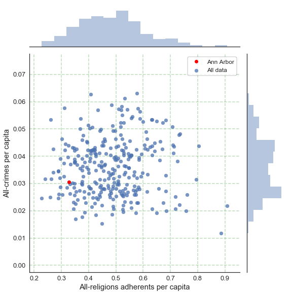
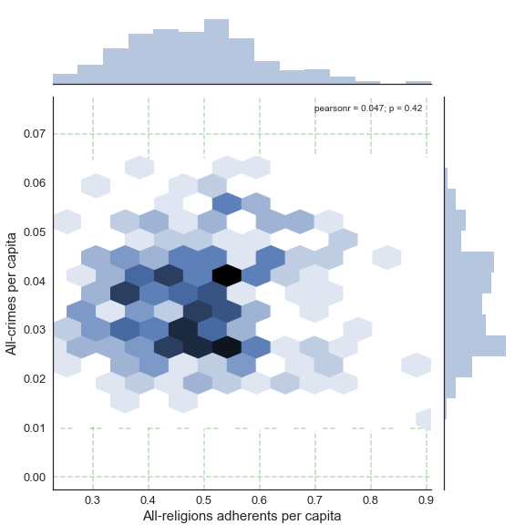
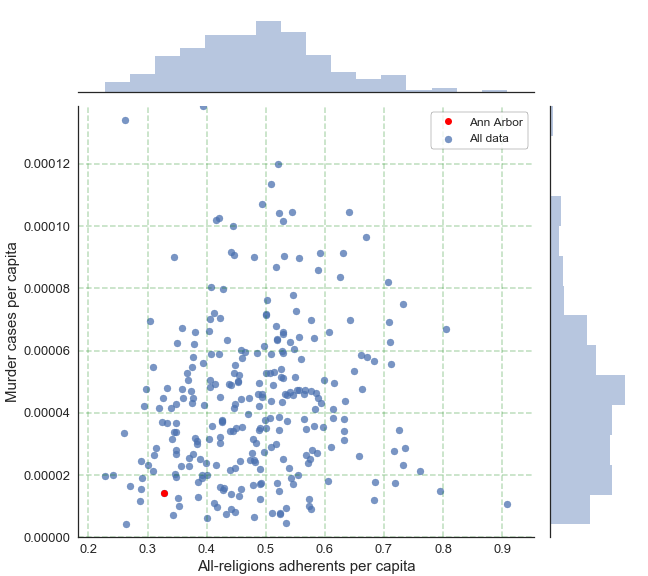
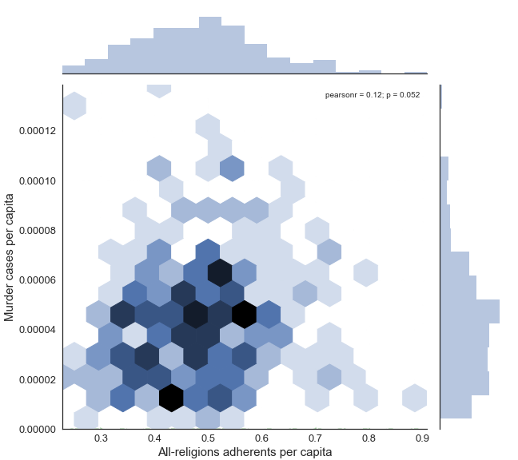
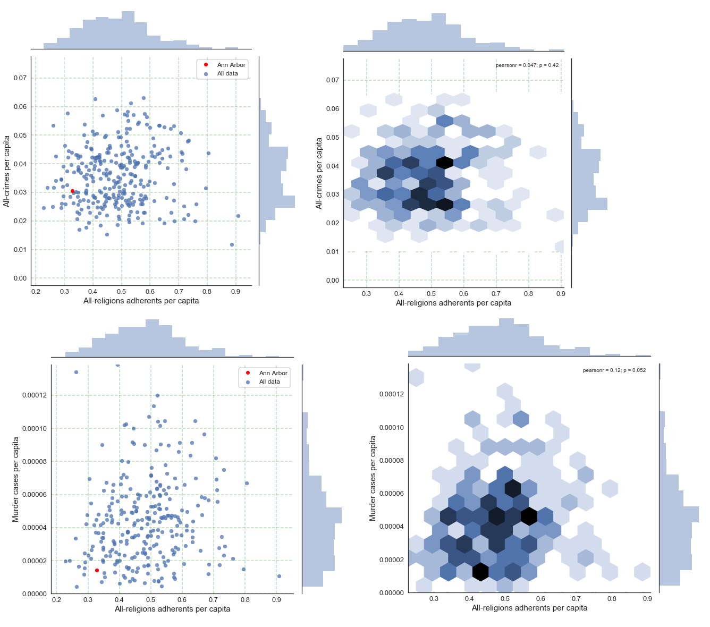

# Project information[¶](#Project-information)

## Data set regions and data description: US and Ann Arbor, MI[¶](#Data-set-regions-and-data-description:-US-and-Ann-Arbor,-MI)

1) USA 2010 Religion data for each metropolitan area (including Ann Arbor area)

2) USA 2010 FBI crime data for each metropolitan area (including Ann Arbor area)

## Question statement[¶](#Question-statement)

1) Based on the number of religion adherents, did the religion help to reduce the crime, statistically?

2) How did Ann Arbor, MI compared to the rest of the US in terms of religions adherents and crime/murder cases?

## Link to the data sets[¶](#Link-to-the-data-sets)

1) 2010 Religion data

    - http://www.thearda.com/Archive/Files/Downloads/RCMSMT10_DL2.asp
    - Data dictionary
    - http://www.thearda.com/Archive/Files/Codebooks/RCMSMT10_CB.asp

2) 2010 FBI crime data

    - https://ucr.fbi.gov/crime-in-the-u.s/2010/crime-in-the-u.s.-2010/tables/table-6

### Data cleaning[¶](#Data-cleaning)

In [1]:

<pre>import pandas as pd
import numpy as np
import matplotlib.pyplot as plt
import matplotlib as mpl
import re
import seaborn as sns
</pre>

In [2]:

<pre>#cleaning religion data
df1 = pd.read_excel(r".\ProjData\U.S. Religion Census.XLSX")
df1 = df1.loc[:,['MTNAME','TOTADH','POP2010']]
df1 = df1.dropna(axis = 0)
df1['ADH per capita'] = df1['TOTADH'] / df1['POP2010']
df1 = df1.set_index('MTNAME')
df1['Metro name'] = df1.apply(lambda x: x.name[0:-30], axis = 1)
df1 = df1.set_index('Metro name')
df1 = df1[['ADH per capita']]
</pre>

In [3]:

<pre>#cleaning 2010 FBI data
df2 = pd.read_excel(r".\ProjData\table-6.xls", skiprows = 
                    [0, 1, 2, 2224, 2225, 2226, 2227, 2228, 2229])
df2['Metropolitan Statistical Area']  = df2['Metropolitan Statistical Area'].ffill()
df2 = df2.loc[:,['Metropolitan Statistical Area','Population','Violent crime','Property crime',
                'Murder and nonnegligent manslaughter']]
df2[df2[:] == ' '] = np.nan
df2['Total crime'] = df2.apply(lambda x: np.nansum([x['Violent crime'],x['Property crime']]), axis = 1)

df2_g = df2.groupby(['Metropolitan Statistical Area']).ffill()
df2_g = df2_g.groupby(['Metropolitan Statistical Area']).bfill()
df2_g = df2_g.groupby(['Metropolitan Statistical Area']).max()
df2_g = df2_g.drop(df2_g.index[0],axis = 0)
df2_g = df2_g.rename(columns={df2_g.columns[3]:'Murder'})
df2_g['Murder per capita'] = df2_g['Murder'] / df2_g['Population']
df2_g['Crime per capita'] =  df2_g['Total crime'] / df2_g['Population']

#
# Nashville-Davidson has '       ' as value
# (error in the data source file, the cell was not completely merged)
# Nevertheless, that row can be dropped without affecting the result
# 
# get just the total crime and population

df2_g['Metro name'] = df2_g.apply(lambda x: x.name[0:-7], axis = 1)
df2_g = df2_g.set_index('Metro name')
df2_g = df2_g[['Murder per capita','Crime per capita']]
</pre>

### Data Preparation: get x, y axes[¶](#Data-Preparation:-get-x,-y-axes)

In [4]:

<pre>dfm = pd.merge(df1, df2_g, how='inner', left_index=True, right_index=True)

x_ADH = dfm['ADH per capita'].values
y_Crime = dfm['Crime per capita'].values

dfm_mur = dfm.drop((dfm[dfm['Murder per capita'] == 0]).index,axis = 0)
x_ADH_mur = dfm_mur['ADH per capita'].values
y_Murder = dfm_mur['Murder per capita'].values

x_Mur_min = x_ADH_mur.min()
x_Mur_max = x_ADH_mur.max()

y_Mur_min = y_Murder.min()
y_Mur_max = y_Murder.max()
</pre>

In [5]:

<pre>x_ann = dfm.loc['Ann Arbor, MI', 'ADH per capita']
y_c_ann = dfm.loc['Ann Arbor, MI', 'Crime per capita']
y_m_ann = dfm.loc['Ann Arbor, MI', 'Murder per capita']
</pre>

### Plotting Results[¶](#Plotting-Results)

In [6]:

<pre>sns.set_style('white')

x1_str = 'All-religions adherents per capita'
y1_str = 'All-crimes per capita'

ax1 = (sns.jointplot(x_ADH, y_Crime, kind = 'scatter', alpha = 0.75, zorder = 1, label='All data')
        .set_axis_labels(x1_str, y1_str, size = 15))
# plt.scatter(x_ann,y_c_ann, color = 'r',zorder = 3)

ymin1, ymax1 = plt.ylim()
xmin1, xmax1 = plt.xlim()

plt.yticks(size = 16)

fig = plt.gcf()
fig.set_size_inches(8,8)

ax_total = fig.get_axes()
plt.axes(ax_total[0])
plt.yticks(size = 13)
plt.xticks(size = 13)
ax = plt.gca()
ax.xaxis.grid(color='g', linestyle='--', linewidth=0.4, zorder = 0)
ax.yaxis.grid(color='g', linestyle='--', linewidth=0.4, zorder = 0)
plt.subplots_adjust(left = 0.1)
ax1.ax_joint.plot([x_ann],[y_c_ann],'ro', label='Ann Arbor')
plt.legend(prop={'size':12}, frameon = True, facecolor ='w', edgecolor = 'k')
plt.savefig("2010_s_all_crime.png")

#plot hex graph
ax1 = sns.jointplot(x_ADH, y_Crime, kind = 'hex').set_axis_labels(x1_str, y1_str, size = 15)
plt.ylim(ymin1, ymax1)
plt.xlim(xmin1, xmax1)

plt.yticks(size = 16)

fig = plt.gcf()
fig.set_size_inches(8,8)

ax_total = fig.get_axes()
plt.axes(ax_total[0])
plt.yticks(size = 13)
plt.xticks(size = 13)
ax = plt.gca()
ax.xaxis.grid(color='g', linestyle='--', linewidth=0.4, zorder = 0)
ax.yaxis.grid(color='g', linestyle='--', linewidth=0.4, zorder = 0)
plt.subplots_adjust(left = 0.1)
plt.savefig("2010_h_all_crime.png")
plt.show()
</pre>

In [ ]:

<pre> 
</pre>

In [7]:

<pre>y1_str = 'Murder cases per capita'

ax1 = (sns.jointplot(x_ADH_mur, y_Murder, kind = 'scatter', alpha = 0.75, zorder = 0, label='All data')
        .set_axis_labels(x1_str, y1_str, size = 15))

ax1.ax_joint.plot([x_ann],[y_m_ann],'ro',zorder = 3, label='Ann Arbor')

plt.ylim(0, y_Mur_max)
ymin1, ymax1 = plt.ylim()
xmin1, xmax1 = plt.xlim()

plt.yticks(size = 16)

fig = plt.gcf()
fig.set_size_inches(9,8)

ax_total = fig.get_axes()
plt.axes(ax_total[0])
plt.yticks(size = 13)
plt.xticks(size = 13)
ax = plt.gca()
ax.xaxis.grid(color='g', linestyle='--', linewidth=0.4, zorder = 0)
ax.yaxis.grid(color='g', linestyle='--', linewidth=0.4, zorder = 0)
plt.subplots_adjust(left = 0.12)
plt.legend(prop={'size':12}, frameon = True, facecolor ='w', edgecolor = 'k')
plt.savefig("2010_s_murder.png")

#plot hex graph
ax1 = sns.jointplot(x_ADH_mur, y_Murder, kind = 'hex').set_axis_labels(x1_str, y1_str, size = 15)

plt.ylim(0, y_Mur_max)
plt.xlim(xmin1, xmax1)

plt.yticks(size = 16)

fig = plt.gcf()
fig.set_size_inches(9,8)

ax_total = fig.get_axes()
plt.axes(ax_total[0])
plt.yticks(size = 13)
plt.xticks(size = 13)
ax = plt.gca()
ax.xaxis.grid(color='g', linestyle='--', linewidth=0.4, zorder = 0)
ax.yaxis.grid(color='g', linestyle='--', linewidth=0.4, zorder = 0)
plt.subplots_adjust(left = 0.12)
plt.savefig("2010_h_murder.png")

plt.show()
</pre>

## Discussion based on the research question[¶](#Discussion-based-on-the-research-question)

The visualization on the relationships between crime rate and number of religion adherents are shown here. The data were obtained from FBI data and religion census. Both data sets are for the year of 2010\. 1) the total numbers of crime and 2) the total number of murder cases per population of each metropolitan area were calculated and used in the comparison. The first figure shows the scatter plot of all-religions adherents per capita versus all crime cases. It can be seen that the scatter plot itself does not show a clear relationship between these two parameters. Therefore, the number of people who have a certain religion does not directly correlate to the number of crime or murder case that a certain city will face. Ann Arbor MI, in particular has the number of religions adherents per capita of 0.328 (below average) and have murder and crime per capita of 0.000014 (below average) and 0.0305 (about the average), respectively. Ann Arbor can be considered as a low religions adherent city with below average murder cases and about average in terms of overall crime cases.

Therefore, the number of people who have a certain religion does not correlate to the amount of crime. It should be noted that the histogram above x-axis, is just about how the religions data are distributed regardless of crime/murder cases. In most cities, less than 70% of people have religion. This analysis shows that the quantity of religion adherents did not (in 2010) help to reduce the crime or murder cases. It was not correlated with the crime/murder cases. This is somewhat contradict to the belief that as more people have religion, people will be better and the crime should reduce. Yet, this does not necessarily counter intuitive, because the quantity does not tell the quality or how religious of a person is. Based on the obtained census data, when one person stated that s/he is a religion adherent, it does not mean that s/he won't commit a crime.

### Discussion based on Cairo's principle[¶](#Discussion-based-on-Cairo's-principle)

#### Truthfulness, beauty, functionality, and insightfulness[¶](#Truthfulness,-beauty,-functionality,-and-insightfulness)

My design choice for my visual in regards to truthfulness is to use seaborn joint point. This plot give the true value of data and the histogram of each axis. The color of Ann Arbor is designated to be red. This information is described in the legend part. The data were cleaned completely and it was adjusted to be in the form of value per the number of population. This is to allow a fair comparison between the city with small and large population.

In regard to Cairo's principle of beauty, I minimize the non-data-ink, and enlarge the font size of the axis label and ticks label so that it is legible for the reader. The hex plots were also provided so that they can beautifully give the information on the density of the data. Red color for Ann Arbor was used so that it was clear on the location of the Ann Arbor data.

In regard to Cairo's principle of functionality, my visualization give the full functionality to the reader to understand the relationship between the number of religion adherents and the number of crime and murder cases per capita. The histogram allow the reader to see the comparison between Ann Arbor and the rest of US clearly.

In regard to Cairo's principle of insightfulness, my visualization tell the answer to the important research question. This answer tell whether the number of religion adherent can help to reduce the crime or not. Intuitively, the number of people who has religions should commit less crime compared to people who are not abide by a certain religious belief. Nevertheless, my graph show that the quantity or number of people who have religion alone does not help to reduce the crime. The data suggests that the concentration degree of a person who is abide by religion's rule should also be considered. Therefore, this visualization help to not casually conclude that the number of religion adherent can indicate the decrease in crime or murder cases.

## Appendix: Intermediate data values[¶](#Appendix:-Intermediate-data-values)

In [8]:

<pre>dfm
</pre>

Out[8]:

<table border="1" class="dataframe">

<thead>

<tr style="text-align: right;">

<th>ADH per capita</th>

<th>Murder per capita</th>

<th>Crime per capita</th>

</tr>

<tr>

<th>Metro name</th>

</tr>

</thead>

<tbody>

<tr>

<th>Abilene, TX</th>

<td>0.632222</td>

<td>0.000031</td>

<td>0.040403</td>

</tr>

<tr>

<th>Akron, OH</th>

<td>0.425786</td>

<td>0.000037</td>

<td>0.034903</td>

</tr>

<tr>

<th>Albany, GA</th>

<td>0.516782</td>

<td>0.000087</td>

<td>0.050786</td>

</tr>

<tr>

<th>Albany-Schenectady-Troy, NY</th>

<td>0.428175</td>

<td>0.000015</td>

<td>0.030041</td>

</tr>

<tr>

<th>Albuquerque, NM</th>

<td>0.460034</td>

<td>0.000058</td>

<td>0.045666</td>

</tr>

<tr>

<th>Alexandria, LA</th>

<td>0.670879</td>

<td>0.000058</td>

<td>0.052308</td>

</tr>

<tr>

<th>Allentown-Bethlehem-Easton, PA-NJ</th>

<td>0.500896</td>

<td>0.000035</td>

<td>0.025262</td>

</tr>

<tr>

<th>Altoona, PA</th>

<td>0.524302</td>

<td>0.000008</td>

<td>0.020552</td>

</tr>

<tr>

<th>Amarillo, TX</th>

<td>0.682457</td>

<td>0.000057</td>

<td>0.053257</td>

</tr>

<tr>

<th>Ames, IA</th>

<td>0.490954</td>

<td>0.000012</td>

<td>0.031841</td>

</tr>

<tr>

<th>Anchorage, AK</th>

<td>0.339950</td>

<td>0.000042</td>

<td>0.043192</td>

</tr>

<tr>

<th>Anderson, IN</th>

<td>0.369382</td>

<td>0.000023</td>

<td>0.035595</td>

</tr>

<tr>

<th>Anderson, SC</th>

<td>0.649621</td>

<td>0.000053</td>

<td>0.052938</td>

</tr>

<tr>

<th>Ann Arbor, MI</th>

<td>0.328303</td>

<td>0.000014</td>

<td>0.030521</td>

</tr>

<tr>

<th>Appleton, WI</th>

<td>0.672817</td>

<td>0.000000</td>

<td>0.022925</td>

</tr>

<tr>

<th>Asheville, NC</th>

<td>0.543191</td>

<td>0.000019</td>

<td>0.026846</td>

</tr>

<tr>

<th>Athens-Clarke County, GA</th>

<td>0.395931</td>

<td>0.000042</td>

<td>0.042185</td>

</tr>

<tr>

<th>Atlanta-Sandy Springs-Marietta, GA</th>

<td>0.497212</td>

<td>0.000061</td>

<td>0.038764</td>

</tr>

<tr>

<th>Atlantic City-Hammonton, NJ</th>

<td>0.426842</td>

<td>0.000080</td>

<td>0.040802</td>

</tr>

<tr>

<th>Augusta-Richmond County, GA-SC</th>

<td>0.529106</td>

<td>0.000102</td>

<td>0.052282</td>

</tr>

<tr>

<th>Austin-Round Rock-San Marcos, TX</th>

<td>0.439207</td>

<td>0.000034</td>

<td>0.041199</td>

</tr>

<tr>

<th>Bakersfield-Delano, CA</th>

<td>0.480190</td>

<td>0.000090</td>

<td>0.043062</td>

</tr>

<tr>

<th>Baltimore-Towson, MD</th>

<td>0.420772</td>

<td>0.000103</td>

<td>0.037760</td>

</tr>

<tr>

<th>Bangor, ME</th>

<td>0.240737</td>

<td>0.000020</td>

<td>0.031667</td>

</tr>

<tr>

<th>Barnstable Town, MA</th>

<td>0.534351</td>

<td>0.000005</td>

<td>0.034074</td>

</tr>

<tr>

<th>Battle Creek, MI</th>

<td>0.326040</td>

<td>0.000045</td>

<td>0.044012</td>

</tr>

<tr>

<th>Bay City, MI</th>

<td>0.534680</td>

<td>0.000009</td>

<td>0.028075</td>

</tr>

<tr>

<th>Beaumont-Port Arthur, TX</th>

<td>0.712385</td>

<td>0.000056</td>

<td>0.043636</td>

</tr>

<tr>

<th>Bellingham, WA</th>

<td>0.289261</td>

<td>0.000025</td>

<td>0.034647</td>

</tr>

<tr>

<th>Billings, MT</th>

<td>0.392648</td>

<td>0.000019</td>

<td>0.040209</td>

</tr>

<tr>

<th>...</th>

<td>...</td>

<td>...</td>

<td>...</td>

</tr>

<tr>

<th>Texarkana, TX-Texarkana, AR</th>

<td>0.609725</td>

<td>0.000029</td>

<td>0.048907</td>

</tr>

<tr>

<th>Topeka, KS</th>

<td>0.457938</td>

<td>0.000060</td>

<td>0.046345</td>

</tr>

<tr>

<th>Trenton-Ewing, NJ</th>

<td>0.525992</td>

<td>0.000054</td>

<td>0.025278</td>

</tr>

<tr>

<th>Tulsa, OK</th>

<td>0.555646</td>

<td>0.000064</td>

<td>0.040476</td>

</tr>

<tr>

<th>Tuscaloosa, AL</th>

<td>0.529803</td>

<td>0.000051</td>

<td>0.044492</td>

</tr>

<tr>

<th>Tyler, TX</th>

<td>0.710053</td>

<td>0.000063</td>

<td>0.041207</td>

</tr>

<tr>

<th>Utica-Rome, NY</th>

<td>0.482550</td>

<td>0.000024</td>

<td>0.026470</td>

</tr>

<tr>

<th>Valdosta, GA</th>

<td>0.499019</td>

<td>0.000038</td>

<td>0.039777</td>

</tr>

<tr>

<th>Victoria, TX</th>

<td>0.709353</td>

<td>0.000069</td>

<td>0.044199</td>

</tr>

<tr>

<th>Vineland-Millville-Bridgeton, NJ</th>

<td>0.349985</td>

<td>0.000063</td>

<td>0.037916</td>

</tr>

<tr>

<th>Virginia Beach-Norfolk-Newport News, VA-NC</th>

<td>0.404169</td>

<td>0.000066</td>

<td>0.038195</td>

</tr>

<tr>

<th>Visalia-Porterville, CA</th>

<td>0.407385</td>

<td>0.000080</td>

<td>0.040904</td>

</tr>

<tr>

<th>Waco, TX</th>

<td>0.614105</td>

<td>0.000038</td>

<td>0.046397</td>

</tr>

<tr>

<th>Warner Robins, GA</th>

<td>0.527741</td>

<td>0.000060</td>

<td>0.041148</td>

</tr>

<tr>

<th>Washington-Arlington-Alexandria, DC-VA-MD-WV</th>

<td>0.445763</td>

<td>0.000053</td>

<td>0.029306</td>

</tr>

<tr>

<th>Waterloo-Cedar Falls, IA</th>

<td>0.570674</td>

<td>0.000024</td>

<td>0.026935</td>

</tr>

<tr>

<th>Wausau, WI</th>

<td>0.648658</td>

<td>0.000000</td>

<td>0.019205</td>

</tr>

<tr>

<th>Wenatchee-East Wenatchee, WA</th>

<td>0.441840</td>

<td>0.000009</td>

<td>0.028643</td>

</tr>

<tr>

<th>Wichita Falls, TX</th>

<td>0.663034</td>

<td>0.000048</td>

<td>0.045502</td>

</tr>

<tr>

<th>Wichita, KS</th>

<td>0.508087</td>

<td>0.000029</td>

<td>0.043809</td>

</tr>

<tr>

<th>Williamsport, PA</th>

<td>0.489764</td>

<td>0.000017</td>

<td>0.021569</td>

</tr>

<tr>

<th>Wilmington, NC</th>

<td>0.422420</td>

<td>0.000030</td>

<td>0.041074</td>

</tr>

<tr>

<th>Winchester, VA-WV</th>

<td>0.428646</td>

<td>0.000016</td>

<td>0.024757</td>

</tr>

<tr>

<th>Winston-Salem, NC</th>

<td>0.522328</td>

<td>0.000035</td>

<td>0.046436</td>

</tr>

<tr>

<th>Worcester, MA</th>

<td>0.519847</td>

<td>0.000017</td>

<td>0.026224</td>

</tr>

<tr>

<th>Yakima, WA</th>

<td>0.444828</td>

<td>0.000100</td>

<td>0.049855</td>

</tr>

<tr>

<th>York-Hanover, PA</th>

<td>0.388443</td>

<td>0.000025</td>

<td>0.023013</td>

</tr>

<tr>

<th>Youngstown-Warren-Boardman, OH-PA</th>

<td>0.529744</td>

<td>0.000059</td>

<td>0.036449</td>

</tr>

<tr>

<th>Yuba City, CA</th>

<td>0.319890</td>

<td>0.000042</td>

<td>0.028425</td>

</tr>

<tr>

<th>Yuma, AZ</th>

<td>0.373975</td>

<td>0.000047</td>

<td>0.030065</td>

</tr>

</tbody>

</table>

296 rows × 3 columns

In [9]:

<pre>dfm_mur
</pre>

Out[9]:

<table border="1" class="dataframe">

<thead>

<tr style="text-align: right;">

<th>ADH per capita</th>

<th>Murder per capita</th>

<th>Crime per capita</th>

</tr>

<tr>

<th>Metro name</th>

</tr>

</thead>

<tbody>

<tr>

<th>Abilene, TX</th>

<td>0.632222</td>

<td>0.000031</td>

<td>0.040403</td>

</tr>

<tr>

<th>Akron, OH</th>

<td>0.425786</td>

<td>0.000037</td>

<td>0.034903</td>

</tr>

<tr>

<th>Albany, GA</th>

<td>0.516782</td>

<td>0.000087</td>

<td>0.050786</td>

</tr>

<tr>

<th>Albany-Schenectady-Troy, NY</th>

<td>0.428175</td>

<td>0.000015</td>

<td>0.030041</td>

</tr>

<tr>

<th>Albuquerque, NM</th>

<td>0.460034</td>

<td>0.000058</td>

<td>0.045666</td>

</tr>

<tr>

<th>Alexandria, LA</th>

<td>0.670879</td>

<td>0.000058</td>

<td>0.052308</td>

</tr>

<tr>

<th>Allentown-Bethlehem-Easton, PA-NJ</th>

<td>0.500896</td>

<td>0.000035</td>

<td>0.025262</td>

</tr>

<tr>

<th>Altoona, PA</th>

<td>0.524302</td>

<td>0.000008</td>

<td>0.020552</td>

</tr>

<tr>

<th>Amarillo, TX</th>

<td>0.682457</td>

<td>0.000057</td>

<td>0.053257</td>

</tr>

<tr>

<th>Ames, IA</th>

<td>0.490954</td>

<td>0.000012</td>

<td>0.031841</td>

</tr>

<tr>

<th>Anchorage, AK</th>

<td>0.339950</td>

<td>0.000042</td>

<td>0.043192</td>

</tr>

<tr>

<th>Anderson, IN</th>

<td>0.369382</td>

<td>0.000023</td>

<td>0.035595</td>

</tr>

<tr>

<th>Anderson, SC</th>

<td>0.649621</td>

<td>0.000053</td>

<td>0.052938</td>

</tr>

<tr>

<th>Ann Arbor, MI</th>

<td>0.328303</td>

<td>0.000014</td>

<td>0.030521</td>

</tr>

<tr>

<th>Asheville, NC</th>

<td>0.543191</td>

<td>0.000019</td>

<td>0.026846</td>

</tr>

<tr>

<th>Athens-Clarke County, GA</th>

<td>0.395931</td>

<td>0.000042</td>

<td>0.042185</td>

</tr>

<tr>

<th>Atlanta-Sandy Springs-Marietta, GA</th>

<td>0.497212</td>

<td>0.000061</td>

<td>0.038764</td>

</tr>

<tr>

<th>Atlantic City-Hammonton, NJ</th>

<td>0.426842</td>

<td>0.000080</td>

<td>0.040802</td>

</tr>

<tr>

<th>Augusta-Richmond County, GA-SC</th>

<td>0.529106</td>

<td>0.000102</td>

<td>0.052282</td>

</tr>

<tr>

<th>Austin-Round Rock-San Marcos, TX</th>

<td>0.439207</td>

<td>0.000034</td>

<td>0.041199</td>

</tr>

<tr>

<th>Bakersfield-Delano, CA</th>

<td>0.480190</td>

<td>0.000090</td>

<td>0.043062</td>

</tr>

<tr>

<th>Baltimore-Towson, MD</th>

<td>0.420772</td>

<td>0.000103</td>

<td>0.037760</td>

</tr>

<tr>

<th>Bangor, ME</th>

<td>0.240737</td>

<td>0.000020</td>

<td>0.031667</td>

</tr>

<tr>

<th>Barnstable Town, MA</th>

<td>0.534351</td>

<td>0.000005</td>

<td>0.034074</td>

</tr>

<tr>

<th>Battle Creek, MI</th>

<td>0.326040</td>

<td>0.000045</td>

<td>0.044012</td>

</tr>

<tr>

<th>Bay City, MI</th>

<td>0.534680</td>

<td>0.000009</td>

<td>0.028075</td>

</tr>

<tr>

<th>Beaumont-Port Arthur, TX</th>

<td>0.712385</td>

<td>0.000056</td>

<td>0.043636</td>

</tr>

<tr>

<th>Bellingham, WA</th>

<td>0.289261</td>

<td>0.000025</td>

<td>0.034647</td>

</tr>

<tr>

<th>Billings, MT</th>

<td>0.392648</td>

<td>0.000019</td>

<td>0.040209</td>

</tr>

<tr>

<th>Binghamton, NY</th>

<td>0.480878</td>

<td>0.000025</td>

<td>0.027281</td>

</tr>

<tr>

<th>...</th>

<td>...</td>

<td>...</td>

<td>...</td>

</tr>

<tr>

<th>Tampa-St. Petersburg-Clearwater, FL</th>

<td>0.347609</td>

<td>0.000043</td>

<td>0.038872</td>

</tr>

<tr>

<th>Texarkana, TX-Texarkana, AR</th>

<td>0.609725</td>

<td>0.000029</td>

<td>0.048907</td>

</tr>

<tr>

<th>Topeka, KS</th>

<td>0.457938</td>

<td>0.000060</td>

<td>0.046345</td>

</tr>

<tr>

<th>Trenton-Ewing, NJ</th>

<td>0.525992</td>

<td>0.000054</td>

<td>0.025278</td>

</tr>

<tr>

<th>Tulsa, OK</th>

<td>0.555646</td>

<td>0.000064</td>

<td>0.040476</td>

</tr>

<tr>

<th>Tuscaloosa, AL</th>

<td>0.529803</td>

<td>0.000051</td>

<td>0.044492</td>

</tr>

<tr>

<th>Tyler, TX</th>

<td>0.710053</td>

<td>0.000063</td>

<td>0.041207</td>

</tr>

<tr>

<th>Utica-Rome, NY</th>

<td>0.482550</td>

<td>0.000024</td>

<td>0.026470</td>

</tr>

<tr>

<th>Valdosta, GA</th>

<td>0.499019</td>

<td>0.000038</td>

<td>0.039777</td>

</tr>

<tr>

<th>Victoria, TX</th>

<td>0.709353</td>

<td>0.000069</td>

<td>0.044199</td>

</tr>

<tr>

<th>Vineland-Millville-Bridgeton, NJ</th>

<td>0.349985</td>

<td>0.000063</td>

<td>0.037916</td>

</tr>

<tr>

<th>Virginia Beach-Norfolk-Newport News, VA-NC</th>

<td>0.404169</td>

<td>0.000066</td>

<td>0.038195</td>

</tr>

<tr>

<th>Visalia-Porterville, CA</th>

<td>0.407385</td>

<td>0.000080</td>

<td>0.040904</td>

</tr>

<tr>

<th>Waco, TX</th>

<td>0.614105</td>

<td>0.000038</td>

<td>0.046397</td>

</tr>

<tr>

<th>Warner Robins, GA</th>

<td>0.527741</td>

<td>0.000060</td>

<td>0.041148</td>

</tr>

<tr>

<th>Washington-Arlington-Alexandria, DC-VA-MD-WV</th>

<td>0.445763</td>

<td>0.000053</td>

<td>0.029306</td>

</tr>

<tr>

<th>Waterloo-Cedar Falls, IA</th>

<td>0.570674</td>

<td>0.000024</td>

<td>0.026935</td>

</tr>

<tr>

<th>Wenatchee-East Wenatchee, WA</th>

<td>0.441840</td>

<td>0.000009</td>

<td>0.028643</td>

</tr>

<tr>

<th>Wichita Falls, TX</th>

<td>0.663034</td>

<td>0.000048</td>

<td>0.045502</td>

</tr>

<tr>

<th>Wichita, KS</th>

<td>0.508087</td>

<td>0.000029</td>

<td>0.043809</td>

</tr>

<tr>

<th>Williamsport, PA</th>

<td>0.489764</td>

<td>0.000017</td>

<td>0.021569</td>

</tr>

<tr>

<th>Wilmington, NC</th>

<td>0.422420</td>

<td>0.000030</td>

<td>0.041074</td>

</tr>

<tr>

<th>Winchester, VA-WV</th>

<td>0.428646</td>

<td>0.000016</td>

<td>0.024757</td>

</tr>

<tr>

<th>Winston-Salem, NC</th>

<td>0.522328</td>

<td>0.000035</td>

<td>0.046436</td>

</tr>

<tr>

<th>Worcester, MA</th>

<td>0.519847</td>

<td>0.000017</td>

<td>0.026224</td>

</tr>

<tr>

<th>Yakima, WA</th>

<td>0.444828</td>

<td>0.000100</td>

<td>0.049855</td>

</tr>

<tr>

<th>York-Hanover, PA</th>

<td>0.388443</td>

<td>0.000025</td>

<td>0.023013</td>

</tr>

<tr>

<th>Youngstown-Warren-Boardman, OH-PA</th>

<td>0.529744</td>

<td>0.000059</td>

<td>0.036449</td>

</tr>

<tr>

<th>Yuba City, CA</th>

<td>0.319890</td>

<td>0.000042</td>

<td>0.028425</td>

</tr>

<tr>

<th>Yuma, AZ</th>

<td>0.373975</td>

<td>0.000047</td>

<td>0.030065</td>

</tr>

</tbody>

</table>

274 rows × 3 columns

In [ ]:

<pre> 
</pre>

